# Assignment 1 Submission

This readme file contains my writeups for first assignment of Game Hacking summer project


# GDB challenges

## GDB baby step 1

#### binary
For this challenge, we are provided with a binary, and we need to find out the value of eax register at the end of main function.
Taking a look at the binary.
```
$ file debugger0_a
debugger0_a: ELF 64-bit LSB pie executable, x86-64, version 1 (SYSV), dynamically linked, interpreter /lib64/ld-linux-x86-64.so.2, BuildID[sha1]=15a10290db2cd2ec0c123cf80b88ed7d7f5cf9ff, for GNU/Linux 3.2.0, not stripped
$ pwn checksec debugger0_a                                  
[*] '/home/ash/code/summer_project/tasks/debugger0_a'
    Arch:       amd64-64-little
    RELRO:      Full RELRO
    Stack:      No canary found
    NX:         NX enabled
    PIE:        PIE enabled
    SHSTK:      Enabled
    IBT:        Enabled
    Stripped:   No
```

Notice that the binary has PIE enabled.

#### using GDB
Using gdb-gef to disassemble main and set a pie breakpoint near the end of main.

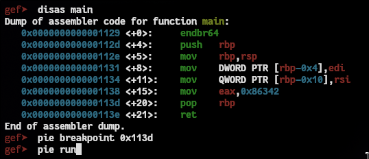

checking for the value of eax at the  break point

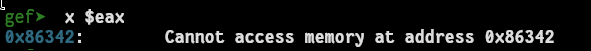

we get our answer, hence the flag
***picoCTF{549698}***

---
## GDB baby steps 2

#### binary
similar to previous challenge we receive a binary and we need to find the value of eax at the end of main, looking into it we get

`$ file debugger0_b`
`$ pwn checksec debugger0_b`
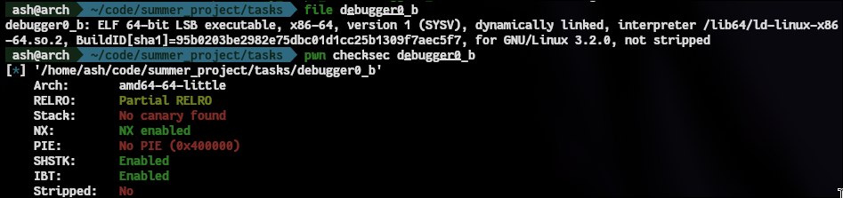

#### using GDB
running the binary using gdb and disassembling main

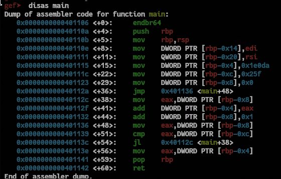

 setting a breakpoint at a return instruction, and examining the value of eax.
 `gef> b *0x401141`
 `gef> r`

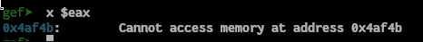

 We have the answer and hence the flag.
 ***picoCTF{307019}***

---
## GDB baby steps 3

#### binary
In this problem, we have to look into the binary where  `0x2262c96b` is loaded into memory and examine 4 bytes and submit that as the flag.
proceeding similarly as before
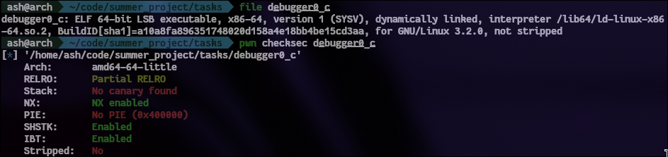

#### running in gdb
now we disassemble main in gdb, and set a breakpoint at the instruction where the number is written on stack.

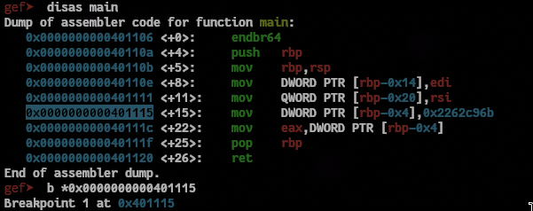

stepping though one instruction using `si`  and examining the value at `rbp-0x4`

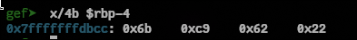

#### Little Endianess
The number `0x2262c96b` is stored like this as the binary follows little endian by default. In little endian system the least significant byte is stored at lowest memory address.

So, our flag is ***picoCTF{0x6bc96222}***

---
## GDB baby steps 4

In this we need to find the constant by which eax is multiplied and submit the constant in decimal format as the flag.
#### binary
`$ file debugger0_d`
`$ pwn checksec debugger0_d`


#### running in gdb
opening the file in gdb and dissembling the main function
`gef> disas main`

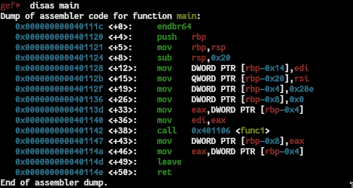

There is a call to func1 after moving something into eax, further looking into func1
`gef> disas func1`

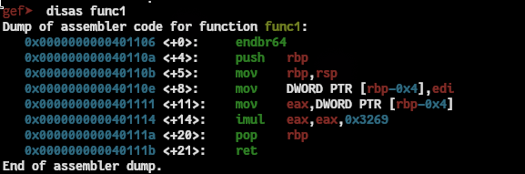

the instruction `imul eax,eax,0x3269` multiplies eax by 12905, hence we have our answer and flag

FLAG:  ***picoCTF{12905}***

---

# CrackMe challenges

## 1. easy keyg3nme

#### Description
easy, you just need to figure out the logic behind key validation. this should be fairly easy even with an ugly debugger. 

#### binary

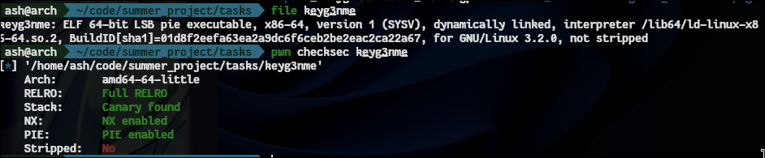

#### reversing using Ghidra

using ghidra to decompile the binary we get

`main` function code
```
int main()
{
  int out;
  long in_FS_OFFSET; //
  undefined4 input;
  long local_10;
  
  local_10 = *(long *)(in_FS_OFFSET + 0x28);
  
  printf("Enter your key:  ");
  __isoc99_scanf("%d",&input);
  out = validate_key(input);
  if (out == 1) {
    puts("Good job mate, now go keygen me.");
  }
  else {
    puts("nope.");
  }

  if (local_10 != *(long *)(in_FS_OFFSET + 0x28)) { 
                    /* WARNING: Subroutine does not return */
    __stack_chk_fail();
  }
  return 0;
}
```

`validate_key` function code

```
bool validate_key(int param_1)
{
  return param_1 % 1223 == 0;
}
```

hence to exploit the keygen we need to pass a number which is a multiple of 1223

#### key

***1223***


---
## 2. jump jump jump 

#### description
Another simple but tricky crackme.... enjoy!!

#### binary

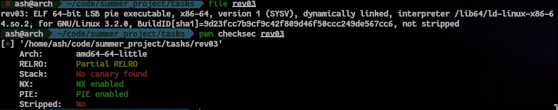

#### reversing the main function

reversing the main function in ghidra we get
`

```
int main()
{
  int len;
  ulong _i;
  char input [112];
  long flag_ptr;
  int i;
  int ascii_sum;
  
  ascii_sum = 0;
  puts("enter the magic string");
  fgets(input,100,stdin);
  len = strlen(input);
  if (len < 12) {
    i = 0;
    while( true ) {
      _i = (ulong)i;
      len = strlen(input);
      if (len <= _i) break;
      ascii_sum = ascii_sum + input[i];
      i = i + 1;
    }
    if (ascii_sum == 1000) {
      flag_ptr = strcat_str();
      printf("flag is flag{");
      for (i = 0; i < 10; i = i + 1) {
        putchar((int)*(char *)(flag_ptr + i));
      }
      puts("}");
    }
    else {
      puts("wrong string\nNo flag for you.");
    }
  }
  else {
    puts("too long...sorry no flag for you!!!");
  }
  return 0;
}

```

The main takes sum of ascii value of all chars in the string and checks if its equal to 1000.
but input has a newline character appended in the end.
so writing a python script to generate a string of ASCII sum 1000

```
import random

while True:
	letters = "abcdefghijklmnopqrstuvwxyzABCDEFGHIJKLMNOPQRSTUVWXYZ1234567890" 
	st = ''.join(random.choice(letters) for i in range(10)) + '\n'

	if(sum(ord(char) for char in st) == 1000):
		print(st)
		break
```

piping the output from our python script into the binary, we get our flag

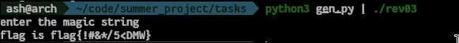

----

## 3. Password Login 2

#### description
No patching allowed, figure out the password, hopefully the difficulty is appropriate

#### binary

`$ file main`

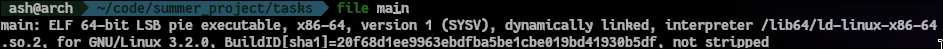

`$pwn checksec main`

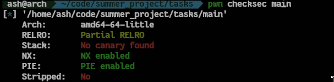

#### reversing in ghidra
trying to reverse in ghidra,we notice that there is a class named password which does the keycheck function

`main` function
```
int main()
{
  char cVar1;
  int iVar2;
  password password_instance [48];
  basic_string input [8];
  basic_string local_38 [10];
  
  std::__cxx11::basic_string<>::basic_string();
                    /* try { // try from 00102398 to 0010239c has its CatchHandler @ 00102472 */
  std::getline<>((basic_istream *)std::cin,input);
  password::password(password_instance);
  iVar2 = std::__cxx11::basic_string<>::length();
                    /* try { // try from 001023c0 to 001023f1 has its CatchHandler @ 00102461 */
  cVar1 = password::checkLength(password_instance,iVar2);
  if (cVar1 == '\x01') {
    std::__cxx11::basic_string<>::basic_string(local_38);
                    /* try { // try from 00102400 to 00102422 has its CatchHandler @ 00102450 */
    cVar1 = password::checkPassword(password_instance,(basic_string)local_38);
    if (cVar1 == '\0') {
      password::wrongPassword();
    }
    else {
      password::rightPassword();
    }
    std::__cxx11::basic_string<>::~basic_string((basic_string<> *)local_38);
  }
  else {
    password::wrongPassword();
  }
  password::~password(password_instance);
  std::__cxx11::basic_string<>::~basic_string((basic_string<> *)input);
  return 0;
}
```
 we need to exploit the methods check_length and check_password.
 Also looking into `.rodata`, we see an encrypted string `x_.1:.-8.4.p6-e.!-`
#### dynamic reversing in gdb-gef

Continuing further in gdb-gef, with test input 12341234 we set a breakpoint at the call to `check_length` function. Inspecting the assembly,we notice a cmp instruction
```
   0x5555555565de <_ZN8password11checkLengthEi+110>:	mov    rax,QWORD PTR [rbp-0x48]
   0x5555555565e2 <_ZN8password11checkLengthEi+114>:	mov    eax,DWORD PTR [rax]
   0x5555555565e4 <_ZN8password11checkLengthEi+116>:	cmp    DWORD PTR [rbp-0x4c],eax
   0x5555555565e7 <_ZN8password11checkLengthEi+119>:	sete   bl
   0x5555555565ea <_ZN8password11checkLengthEi+122>:	lea    rax,[rbp-0x40]
```

looking into the registers, we notice that there is a comparison between `eax` containing 0x7 and `[rbp-0x4c]` containing the length of our input 0x8.

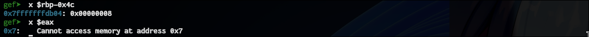

We start again with test input 1234123. and we notice that we enter the first `if` statement.

Further we enter the `check_password` method.
looking into the assembly we notice that our input is xored with 0x42 in a loop, also there is no further checks or encryption later in the function.

Xoring the string we got initially in `.rodata`  with 0x42 we get.


but the length of the string should be 7.

#### Taking the hint from writeups

looking into other people's writups , I got to know that our input is actually compared to `.-8.4.p`, hence the password is `lozlvl2`.

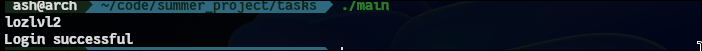


## 4. login-cipher

#### description
ELF64 program. You have to insert the correct password.

#### binary

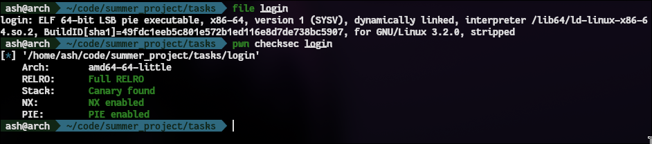

Unfortunately its a stripped binary, so we'll have no function and variable names
#### reversing in ghidra

reversing in ghidra, and looking through all the functions detected by ghidra , we find the one which takes the input and has some weird strings, and one function which is possibly has the decryption algorithm of the strings.
> decrypt function
```
char * FUN_00101218(char *param_1)

{
  int local_14;
  char *i;
  
  local_14 = 0x7b1;
  for (i = param_1; *i != '\0'; i = i + 1) {
    local_14 = (local_14 * 7) % 0x10000;
    *i = *i + ((char)(local_14 / 10) * '\n' - (char)local_14);
  }
  return param_1;
}
```

> function with weird strings
```

undefined8 FUN_001012a1(void)

{
  int iVar1;
  long in_FS_OFFSET;
  undefined local_58 [72];
  long local_10;
  
  local_10 = *(long *)(in_FS_OFFSET + 0x28);
  FUN_00101348("Gtu.}\'uj{fq!p{$",1);
  FUN_00101348(&DAT_00102014,0);
  __isoc99_scanf("%64[^\n]",local_58);
  iVar1 = FUN_001013e3(local_58,"fhz4yhx|~g=5"); // sus 
  if (iVar1 == 0) {
    FUN_00101348("Ftyynjy*",1);
  }
  else {
    FUN_00101348("Zwvup(",1);
  }
  if (local_10 != *(long *)(in_FS_OFFSET + 0x28)) {
                    /* WARNING: Subroutine does not return */
    __stack_chk_fail();
  }
  return 0;
}

```

decrypting all the weird strings using the decrypt function
the string `fhz4yhx|~g=5` is passed to another function along with our input, decrypting it with the function we got

```
#include<stdio.h>

int main(){
	char sus_string[] = "fhz4yhx|~g=5";

	int cur = 0x7b1;
	char *ptr = sus_string;

	for (; *ptr != '\0'; ptr = ptr + 1) {
		cur = (cur * 7) % 0x10000;
		*ptr = *ptr + ((char)(cur / 10) * '\n' - (char)cur);
	}

	printf("%s",sus_string);
}
```

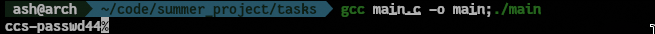

We get a possible key , trying to pass it to the binary

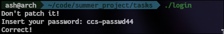

Hence Pwned

---

## 5. iso_32

#### description
a 32bit elf crackme try to solve it :)

#### binary
`$ file crackme`

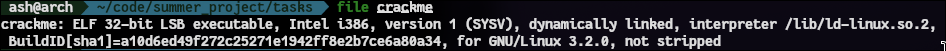

`$ pwn checksec crackme`

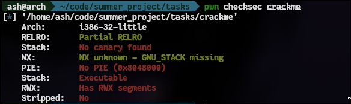
 
#### reversing in ghidra

looking through the code in ghidra, we find that there is no decryption alogorithm or such function anywhere but there exists a function named `__s_func` which prints is probably the win function.

main function
```
undefined4 main(void)
{
  f();
  __f_func();
  return 0;
}
```

f function

```
void f(void)
{
  undefined local_2c [36];
  printf("enter the password:");
  __isoc99_scanf(&DAT_0804a036,local_2c); // &DAT_0804a036 contains "%s"
  return;
}
```

`__f_func`  and `__s_func` functions
```
void __f_func(void)

{
  puts("Ooop!! Try again");
  return;
}
```
```
void __s_func(void)

{
  puts("Great !!");
  return;
}

```

It is a textbook example of stack buffer overflow example, we need to redirect the code execution to  `__s_func` by rewriting the instruction pointer in `f` function by overflowing the stack.

First we need to find the offset, I'll be using gdb to set a breakpoint near the end `f`  and the finding the difference between our input address in stack and the location of `eip` on stack.

#### finding offset using gdb

running the binary in gdb and setting a breakpoint near the end of `f`

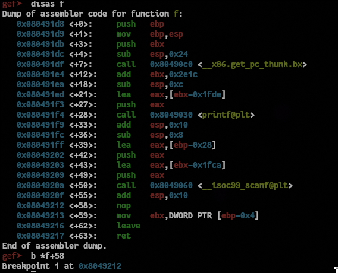

now we pass `12341234` as our input and reach the breakpoint.
Now we find the location of our input on stack and the saved return address

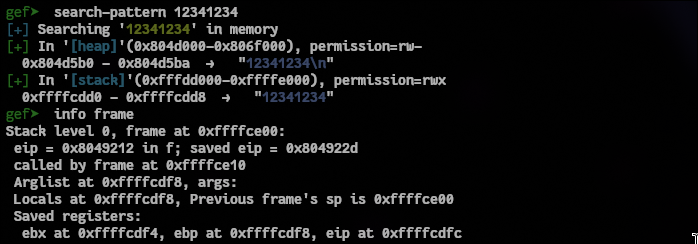

Our offset to reach eip is `0xffffcdfc - 0xffffcd0 = 44` 

and now we need the address of `__s_func`

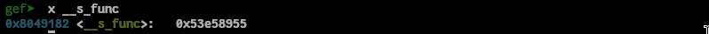

#### Final exploit

Finally, we have everything we need to carry out our exploit,
our payload will be `[44 bytes of padding] + [address of __s_func]`

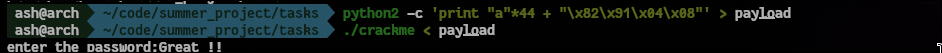

Hence pwned
