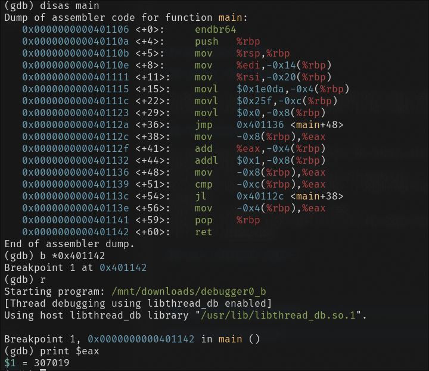
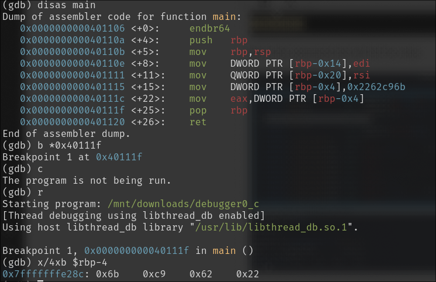
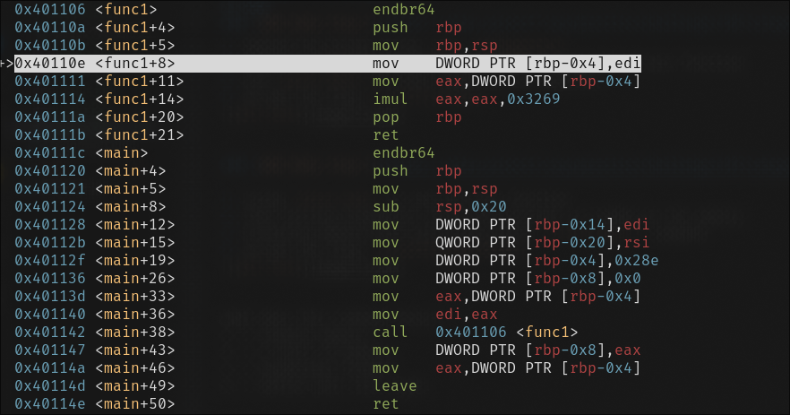
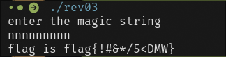
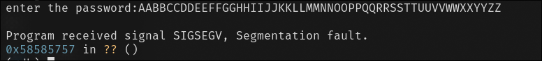
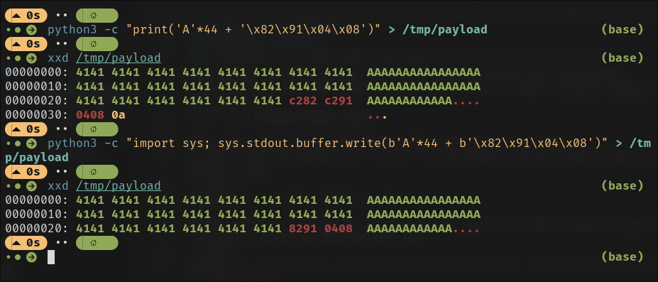

# Writeups for Assignment 1


## GDB

### [GDB Baby Step 1](https://play.picoctf.org/practice/challenge/395?category=3&page=1&search=GDB)

1. Opening the binary using `gdb ./debugger0_a`
2. Using `disas main` to diassemble main function we get that `0x86342` is being stored in EAX register.
3. Converting hex to decimal we get the required integer.


### [GDB Baby Step 2](https://play.picoctf.org/practice/challenge/396?category=3&page=1&search=GDB)

1. Opened the binary using `gdb ./debugger0_b`
2. using `b *0x401142` to set breakpoint at then end of main function
3. use `print $eax` to check value in eax register.
4. we get the flag `picoCTF{307019}`



### [GDB Baby Step 3](https://play.picoctf.org/practice/challenge/397?category=3&page=1&search=GDB)

1. using `disas main` to see the main function
2. Then setting breakpoint after the constant is loaded in the memory.
3. Examining memory byte-wise using given `x/4xb $rbp-4` command.
4. we get the flag: `picoCTF{0x6bc96222}`



what does this command means?\
x -> examine memory \
4 -> 4 units of memory\
x -> hexdecimal format\
b -> define unit size: byte


### [GDB Baby Step 4](https://play.picoctf.org/practice/challenge/398?category=3&page=1&search=GDB)

1. using `info functions` we get to know that `func1` is the function PS is referring to. 
2. setting breakpoint at `func1` and examining disassembly using `disas` we get

3. We can clearly see the constant that is  being multiplied is `0x3269` which in decimal is `12905`
4. we get out flag `picoCTF{12905}`


## Reversing Crackmes

### [Crackmes - 1 - ezman's easy keyg3nme](https://crackmes.one/crackme/5da31ebc33c5d46f00e2c661)

On opening `keyg3nme` binary, it asked for a key. Generating the pseudocode we got a `validate_key` key validation function which just check if the input is divisible by 1223.

### [Crackmes - 2 - cbm-hackers's jumpjumpjump](https://crackmes.one/crackme/5c1a939633c5d41e58e005d1)

On reversing using IDA, I found that the binary asks user for a string and checks where the sum of ASCII values of user input is == 1000. \
So I tried `d`*10 times since ascii of lowercase `d` is `100`. Didn't get the flag. \
On further checking from pseudocode, I found that the new line character (ascii 10) is included in the summation.
Therefore I needed to make sum = 990. \
using `n` 9 times, since ascii of n is 110 solve this.\



### [Crackmes - 4 - Silva97's login-cipher](https://crackmes.one/crackme/5db0ef9f33c5d46f00e2c729)

On opening the binary with IDA and getting the pseudocode, there was a function for decoding actual strings and printing it. 
The function uses this algo for decryption
```cpp
_BYTE *__fastcall decrypter(_BYTE *a1)
{
  int v2; // [rsp+Ch] [rbp-Ch]
  _BYTE *v3; // [rsp+10h] [rbp-8h]

  v3 = a1;
  v2 = 1969;
  while ( *v3 )
  {
    v2 = 7 * v2 % 0x10000;
    *v3++ -= v2 % 10;
  }
  return a1;
}
```

```cpp
__int64 __fastcall main(int a1, char **a2, char **a3)
{
  char v4[72]; // [rsp+0h] [rbp-50h] BYREF
  unsigned __int64 v5; // [rsp+48h] [rbp-8h]

  v5 = __readfsqword(0x28u);
  decrypt_string_and_print("Gtu.}'uj{fq!p{$", 1);
  decrypt_string_and_print(aLszl, 0);
  __isoc99_scanf("%64[^\n]", v4);
  if ( validator(v4, (__int64)"fhz4yhx|~g=5") )
    decrypt_string_and_print("Zwvup(", 1);
  else
    decrypt_string_and_print("Ftyynjy*", 1);
  return 0LL;
}
```

the `validator` function checks if the input string is equal to decrypted version of `fhz4yhx|~g=5` using same decryption algorithm. 

> This same algorithm was used to decrypt the password and initial texts.

Wrote this python script to decrypt the string.

```py
def decrypt(s):
    v = 1969
    out = ""
    for c in s:
        v = (7 * v) % 0x10000
        out += chr(ord(c)-(v % 10))
    return out
print(decrypt("fhz4yhx|~g=5"))
```
got `ccs-passwd44` as password.

### [Crackmes - 5 - math__0x0's iso_32](https://crackmes.one/crackme/5d8dfa7433c5d46f00e2c544)

On opening using IDA, there were only 2 functions being called from main()
```cpp
int __cdecl main(int argc, const char **argv, const char **envp)
{
  f();
  _f_func();
  return 0;
}
```
the `f()` function asks user for password using scanf and `_f_func()` outputs "Ooop!! Try again".
There was another function `_s_func()` found using `objdump -D` which outputs "Great!!". So it was obvious we have to call that function somehow abusing buffer overflow.

First to get the payload, I opened binary in gdb using `gdb ./crackme`
the running the binary using `run` and I tried entering this long pattern
`AABBCCDDEEFFGGHHIIJJKKLLMMNNOOPPQQRRSSTTUUVVWWXXYYZZ` which received segfault at `0x58585757`


This means there are 44 characters before this (57 is ascii for W)
So now to add the address of `_s_func` to EIP pointer, we will need to get its address using 
```bash
objdump -D ./crackme | grep __s_func
```
we got `08049182` as address. Converting this to little endian format, we get `82910408` now we can make payload like 
```bash
python3 -c "import sys; sys.stdout.buffer.write(b'A'*44 + b'\x82\x91\x04\x08')" > /tmp/payload
```
I previously tried using print function in python but that was writing some extra bytes to payload due to some unicode encoding issues for bytes and not making correct payload\

and use like this 
```bash
cat /tmp/payload | ./crackme
```


Thankyou.