### ASSIGNMENT 1

## (I) GDB picoCTF tasks 

# Task 1: GDB Baby step 1

Task was to find the contents of the eax register at the end of main. 
Here is the photo of disassembled main.

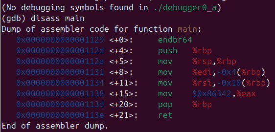

Second last command shows moving 0x86342 into $eax register. If directly run, main will return all the registers before we get to examine them. So, putting a break point at main will help. 
This stops the flow at 0x0000555555555131 in main. Stepping until the command just after moving into $eax lets us examine the register.

A simple _print/d $eax_ gives the contents of eax in decimal form.

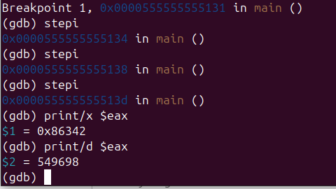

# Task 2: GDB baby step 2

Task is to find the contents of the eax register inside main. 
The disassembled main is as follows:

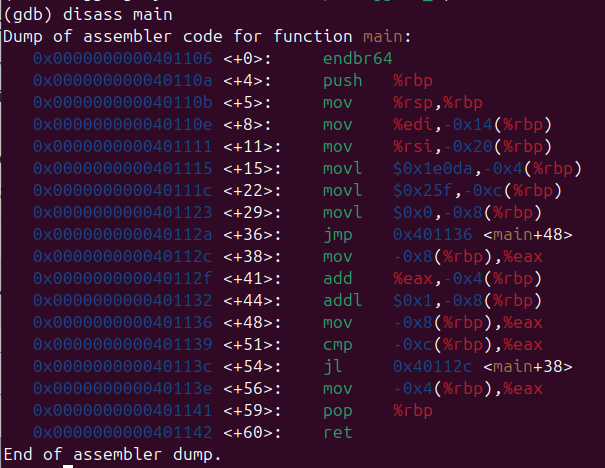

Disass of main shows a set of calculations being carried out. 
1. We can calculate the contents of eax ourselves.
2. We set a breakpoint just after the contents being moved into eax register and then use the command _info register eax_. 

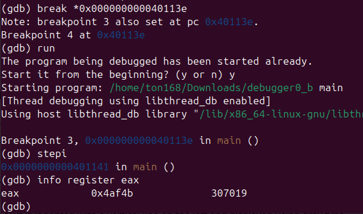

# Task 3: GDB baby step 3
Task is to find byte-wise the memory that the constant 0x2262c96b is loaded. 
Disassembled main is as follows:

The constant is loaded  into the memory at the address 0x0000000000401115. It would be wise to place a break point just after this to examine the register into which it is moved.
Run the main function. Upon reaching the breakpoint, step once to load the contents. 
Use the command _x/4xb $rbp-4_ to find the order of the bytes that was loaded. 

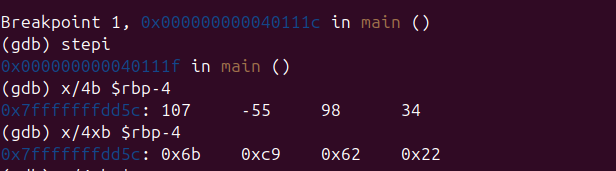

The contents of $rbp-4 shows big endianness. Printing the outputs of $eax will not give this output as the endianness characteristics is not followed. 

# Task 4 : GDB baby step 4
Task is to find the constant by which register $eax is multiplied.
Disassembled main is as follows:

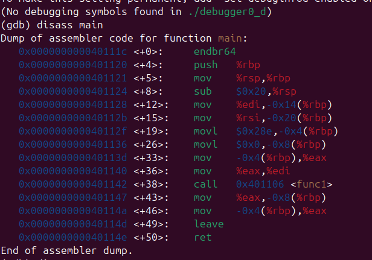

Main shows a function being called in memory address 0x0000000000401142. According to the hint, a function can be referenced by either its name or its starting address in gdb. Starting address is given as 0x401106.

Disassembled function is as follows:

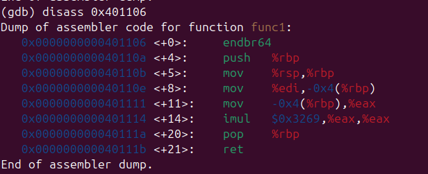

We can see the command imul where the constant $0x3269 is multiplied to $eax. Required constant is hence 12905, the decimal form of 0x3269.

## (II) CRACKME Reverse Engineering tasks 

# Task 1 : ezman's easy keyg3n
Upon running the keyg3nme binary, we observe that it is asking for a key. Task is to find this key.
Using ghidra, we disassemble this binary file.
Under the list of functions, we see the main function

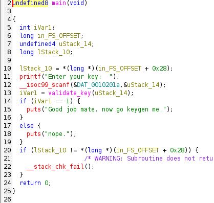

Inside the main, we see the use of another function _validate string_. Upon further investigation of the function _validate string_, we see the following:

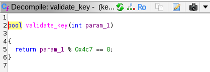

Hence, the key is decimal form of 0x4c7, which is 1223

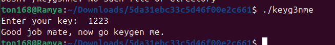

# Task 2 : cbm-hackers's jumpjumpjump
Disassembling the binary file ./rev03, shows us the main function

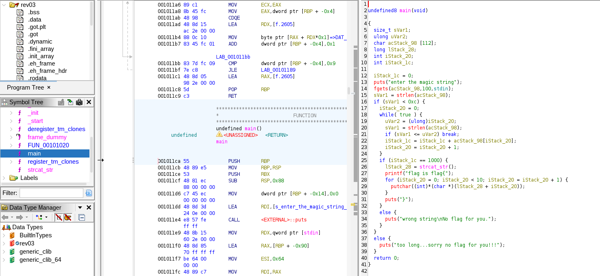

The main function tells us how to get the fail. It first, takes input of a string, acStack_98 and it also stores the length of the string in sVar1. 
The if condition proceeds only if sVar1 is less than 0xc, which is 12, indicating that our _magic string is of length less than 12_. 
Inside the if statement, iStack_20 is initialized to 0 and a while loop begins.

uVar2 is the unsigned long version of iStack_20. 
The loop gets the character sum of entered magical string, which is stored in iStack_lc. 
If the character sum of entered string is 1000, the flag is given to us.
Hence, dddddddddd should work, as ord(d) = 100, character sum of dddddddddd = 100*10 = 1000.
To avoid newline character being considered, we enter
echo -n dddddddddd | ./rev03.

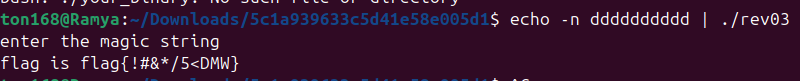

# Task 3 : Loz's Password Login 2
Having run ghidra through the binary file, .main, it showed two important things:
    1. Main function
    2. Password class
The main function gets a standard input and first passes the input through a function, password::checkLength(). 
The checkLength() uses a variable uStack_lc = 0x168 which is 360 in decimal form.
This number is converted to a string using the std::to_string function. An at function is applied to it, with 1 as the parameter.
Hence the returning value will be character "6" (index 1 of 360). Using the operator (=), this character is assigned to pcVar2, on which atoi() function is applied and integer 6 is obtained. 
Later, 1 is added to it. Hence, finally, the length of our desired password is 7.

In the main function, further calls are carried out only if length is equal 7. Once passed, the password is passed through function password::checkPassword().

checkPassword() function was highly confusing. Some major things in it where the comparison between asStack_78 
and asStack_98.
And, the line **std::__cxx11::string::operator+=(asStack_78,(byte)ppStack_a0[4] ^ *pbVar6);**
This shows that the each char of the string is being encoded by XOR'ing it with the key, pbVar6.

I then moved on to another function of the password class. 
There it was clear that the string being encoded is "x_.1:.-8.4.p6-e.!-" and the key is 0x42, which is 66 or char 'B'. 
Reverse encoding of the above string gives following
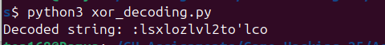 

Above was done with the python file, xor_decoding.py.
But, the above does not seem to be the password. 

# Task 4 : Silva97's login-cipher
Using ghidra on the binary file, under the section functions, the following is observed:

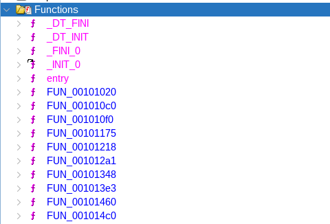

Opening the function, 'entry' shows the use of _libc_start_main() which is the entry point of a program and is called before the main() function runs.

Exact code is : *  __libc_start_main(FUN_001012a1,param_2,&stack0x00000008,FUN_00101460,FUN_001014c0,param_1,auStack_8);*

Hence, from the code, FUN_001012a1 is the main() function.
Opening FUN_001012a1:

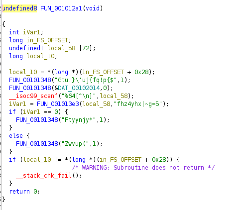

A stack buffer (local_58) and stack canary (local_10) is initialized. Stack canary is defined.
On the next line is the use of another function, FUN_00101348(). 

FUN_00101348:

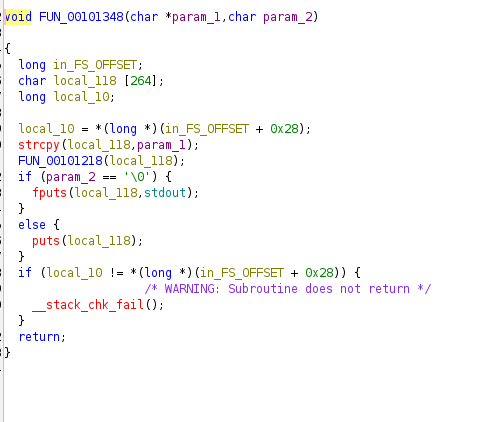

Another buffer is initialized and canary is checked to see if it is modified or not to prevent buffer overflow. The parameter is copyed to the buffer and is run through another function, FUN_00101218().

FUN_00101218:

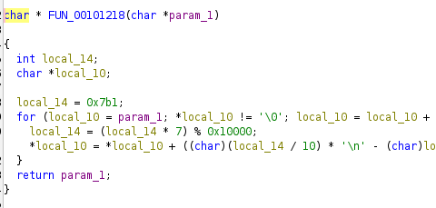

This seems to be a kind of decoding. A similar program is written in python (task4_python1.py) to check what output this function gives on the strings it is used on.

First: 

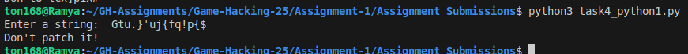

This is the text we observe on running the binary file. 
Similarly, we run other strings which are passed through the function.

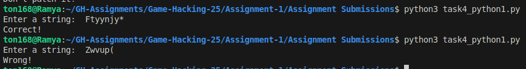

Therefore, if iVarl is 0, we get the message 'Correct!'.

iVarl = FUN_001013e3(local_58,"fhz4yhx|~g=5");
Another function, and the password is most likely to be the encoded version of the string 'fhz4yhx|~g=5'

FUN_001013e3:

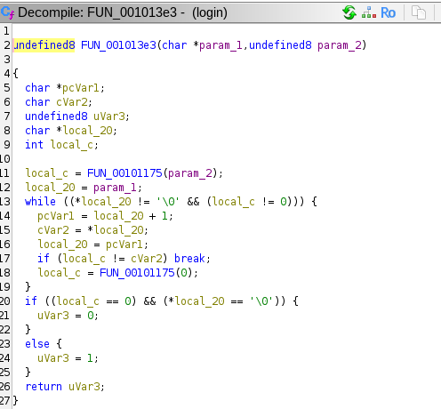

This function returns uVar3, which is 0 when local_c = 0 and local_20 comes to the character '\0'.

There is use of another function, FUN_00101175().

FUN_00101175 : 

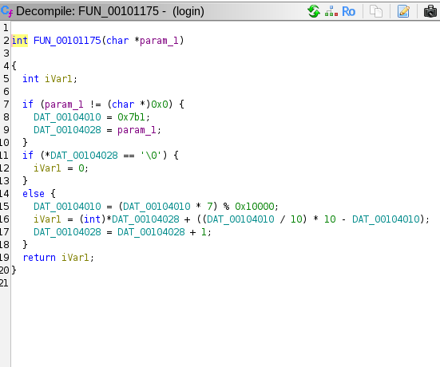

This is similar to the function FUN_00101218(). Hence, we run the above python program on the string which was passed as the password:

We check if this is the password:

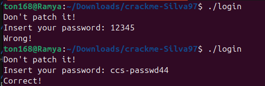

# Task 5: math__0x0's iso_32

Classic case of *buffer overflow exploitation*.
Above can be inferred from observing the main function in ghidra.
It only shows the function to scan the password, with a buffer size of 36 bytes and directly the failure printing function.

To observe where static over flow is observed, we run gdb for dynamic analysis. If we enter a password too long, we get a segmentation error. To over ride this segmentation fault and get our 'success' function, we need to know the offset in the password where the seg fault occurs.
For this, we use the pwntools library.

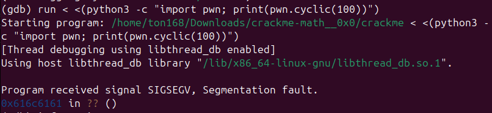

This shows that we get the seg fault in the address 0x616c6161.
Further, running this code gives us the offset:
*python3 -c "import pwn; print(pwn.cyclic_find(0x6161616c))"*

Offset : 44.

We can also find the address of the function we want to over ride, that is the __s_func, or the so called success function, using gdb by disassembling the function.

Address comes out to be : 0x08049182.

Now, we exploit the overflow:

But, this does not give us the success message. 

Reason being the address is not passed as raw binary, and instead as a string. 
This can be prevented by passing the little endian version of the address.

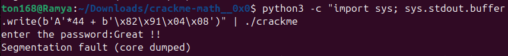

