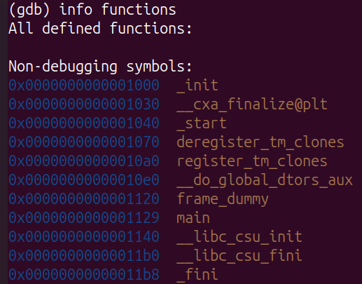
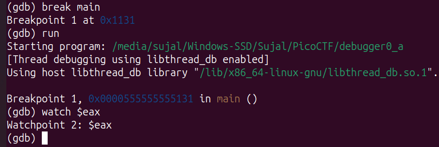
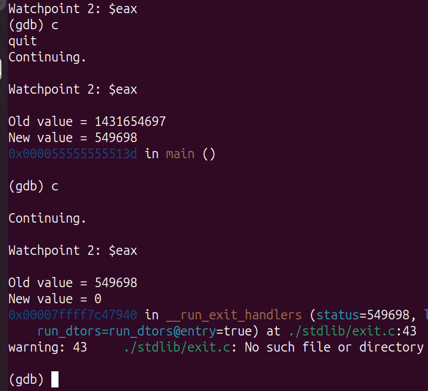
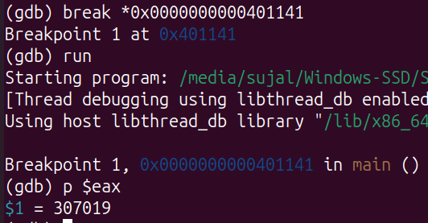
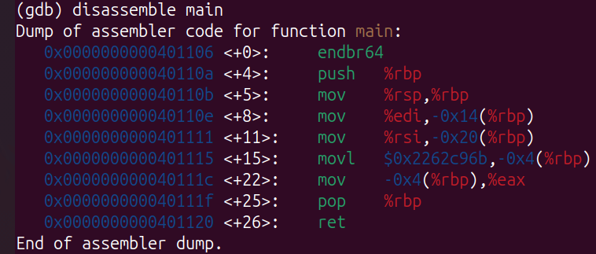
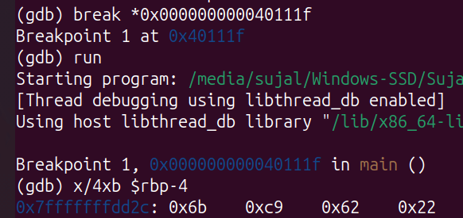
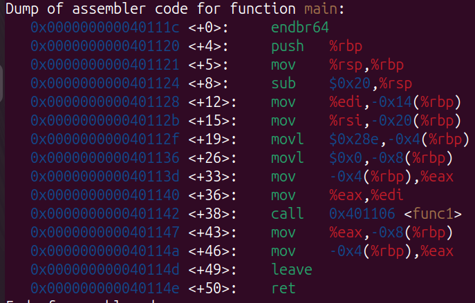
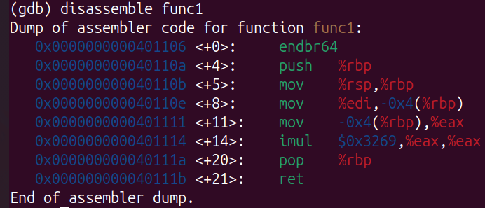

# GDB challenges

## GDB Baby Step 1
First we open the executable with gdb and run `info functions` to see what functions it has.

We need the value in eax at the end of main so let's put a watchpoint on this register so we can observe its value throughout the program.
But to begin we need to run the program so let's put a breakpoint at main and run it.

Now we can simply continue the program and see the value of eax at the end of main.

The final value of eax is 549698 so the flag is `picoCTF{549698}`

## GDB Baby Step 2
This time we will get the assembly code of the main function with the command `disassemble main`

We can set a breakpoint at the last instruction so that we can observe the value of eax at that point.

We print the value stored in eax with `p $eax` and see that it is 307019. So the flag is picoCTF{307019}.

## GDB Baby Step 3
First we get the assembly code for the main function with `disassemble main`

We see that the given constant is being loaded into `-0x4(%rbp)` which is `rbp-4`.

So we add a breakpoint just after the instruction where the constant was loaded into memory. Then we check the value stored at `rbp-4`. Since we need it in little endian and hexadecimal format we use the command given in the hint `x/4xb`.

So the flag is `picoCTF{0x6bc96222}`.

## GDB Baby Step 4
Get the assembly code of main.

There is no multiply instruction in the main function but just after a value is moved into `eax`, there is a call to the function `func1`. So let's examine this function's assembly code.

We see that there is an `imul` instruction where `eax` is multiplied by `0x3269`. Converting this number to decimal gives 12905.

So the flag is `picoCTF{12905}`.